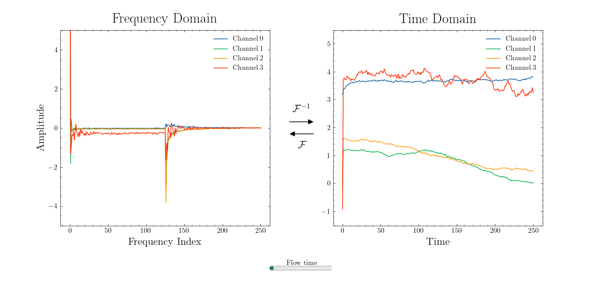

# Time Series Generation Through Flow Matching in the Frequency Domain

This repository implements time series flow matching in the frequency domain.
It is inspired by our ICML 2024 paper: [Time Series Diffusion in the Frequency Domain](https://arxiv.org/pdf/2402.05933).




# 1. Install


From repository:
1. Clone the repository.
2. Create and activate a new environment with conda (with `Python 3.10` or newer).

```shell
conda create -n fmfourier python=3.10
conda activate fmfourier
```
3. Install the requirements.
```shell
pip install -e .
```

4. If you intend to train models, make sure that wandb is correctly configured on your machine by following [this guide](https://docs.wandb.ai/quickstart). 
5. Some of the datasets are automatically downloaded by our scripts via kaggle API. Make sure to create a kaggle token as explained [here](https://towardsdatascience.com/downloading-datasets-from-kaggle-for-your-ml-project-b9120d405ea4).


# 2. Use

## 2.1 Train
In order to train models, you can simply run the following command:

```shell
python cmd/train.py 
```

This command will train a model in the time domain with the `nasa` dataset, based on the config file `train.yaml` located in the folder `cmd/conf`. In order to modify this behaviour, you can use [hydra override syntax](https://hydra.cc/docs/advanced/override_grammar/basic/). 

At the end of training, your model is stored in the `lightning_logs` directory, in a folder named after the current `run_id`. You can find the `run_id` in the logs of the training and in the [wandb dashboard](https://wandb.ai/) if you have correctly configured wandb.

## 2.2 Sample

In order to sample from a trained model, you can simply run the following command:

```shell
python cmd/sample.py model_id=XYZ
```
    
where `XYZ` is the `run_id` of the model you want to sample from. This command uses the information in the config file `sample.yaml` located in the folder `cmd/conf`.
At the end of sampling, the samples are stored in the `lightning_logs` directory, in a folder named after the current `run_id`.
